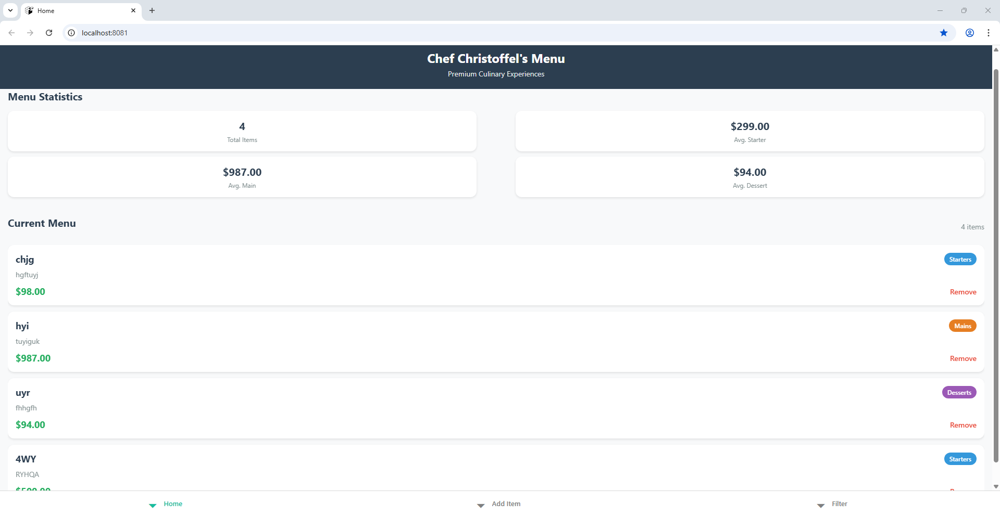
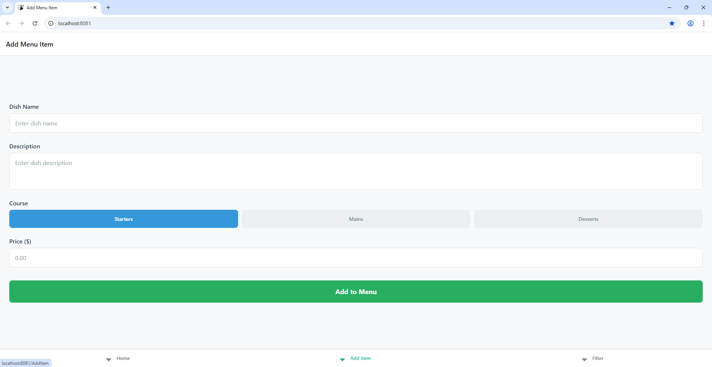
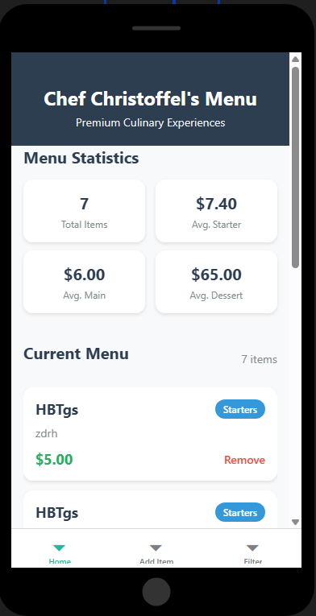
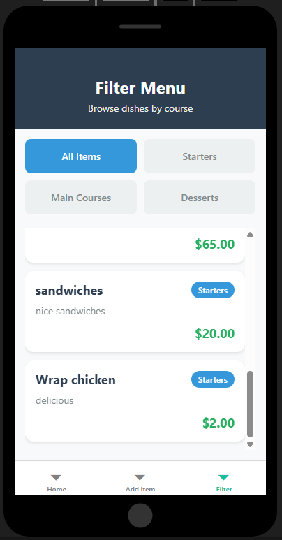

# ChefChristoffelApp

This is a React Native app for managing a restaurant menu, including features like viewing menu items, adding, deleting, and viewing statistics.

---

Youtube video link: https://youtu.be/6OB2r0OBkXE?si=HseNG302ZWWODemh 

# Screenshots 
Desktop Web

Mobile App

## Changelog / Release Notes

### Version 1.0.0

#### Initial Release
- Basic layout with header, stats, and menu list.
- Ability to add new menu items with validation.
- Display of menu items categorized by course: Starters, Mains, Desserts.
- Deletion of menu items with confirmation alert.
- Persistent storage using AsyncStorage.
- Basic styling with a clean, modern look.

---

### Version 1.1.0

#### Fixed List Update Issue on Deletion
- **Problem:** When deleting a menu item, the list did not update visually despite the state updating internally.
- **Solution:**  
  - Added a `refreshCount` dummy state.
  - Added a third screen for adding items to the menu
  - Pass `extraData={refreshCount}` to the `FlatList`.
  - Increment `refreshCount` after deletion to force re-render.
- **Result:** List updates immediately after deleting an item, fixing the UI issue.

### Version 1.2.0

#### UI Enhancements
- Redesigned the statistics display to show a 2x2 grid layout for better visual appeal on mobile.
- Improved styling for stats cards to align with web layout.

### Version 1.3.0

#### Debugging and Logging
- Added console logs for key functions (`deleteMenuItem`, `confirmDelete`, and `loadMenuItems`) for better debugging.
- Included logs to verify delete flow and list updates.

#### Deprecation Warning Fix
- Addressed the warning about `props.pointerEvents` being deprecated.
- Updated usage to adhere to style-based `pointerEvents`.

---

## How to Use
- Launch the app.
- Add new menu items through the form.
- View statistics dynamically updated.
- Delete items using the "Remove" button; list updates accordingly.

---

## Known Issues
- UI animations for deletion are not implemented.
- No undo feature for deletions.
- Styling improvements can be added in future releases.

---

## Future Plans
- Implement editing of menu items.
- Add categories for more detailed filtering.
- Enhance styling for better responsiveness.
- Integrate with a backend server for cloud storage.

---

## Feedback
Feel free to open issues or pull requests for improvements!

---

## License
MIT License (or your preferred license)
